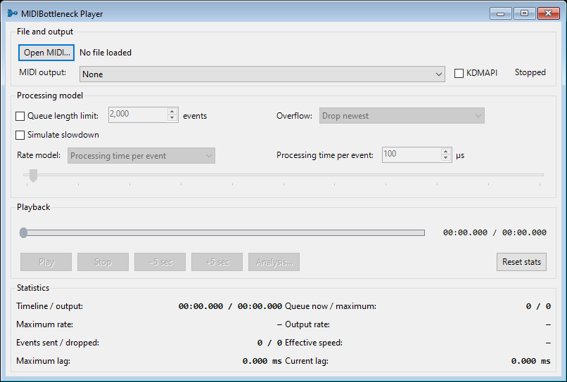

# MIDIBottleneck Player

[](LICENSE)

MIDIBottleneck Player is a Windows MIDI player and deterministic workload simulator. It helps you see how event density, output speed, queue limits, lag, and overflow affect playback—especially with unusually dense MIDI files.

**[Download the latest x64 or x86 executable](https://github.com/ray890/MIDIBottleneck-Player/releases/latest)**



## Key features

- WinMM, compatible KDMAPI, and silent **None** output choices.
- Drag-and-drop loading for `.mid` and `.midi` files.
- Cancellable background loading with compact, segmented storage for very large event counts.
- A memory preflight and warning for unusually large files.
- Optional processing-time, direct events-per-second, MIDI-bitrate, finite-queue, and overflow models, including forward-only dropping without delayed output.
- A delayed finite-queue choice that can discard an old unsent note together with its matching release, instead of dropping an arbitrary single MIDI event.
- Live queue, output-rate, lag, effective-speed, and channel statistics.
- Whole-file Analysis graphs with predicted queue pressure and output completion.
- A 16-channel monitor with safe live overrides and per-channel filtering.
- Checked-by-default bank, program, controller, bend, pressure, and RPN/NRPN restoration when Play or Seek begins in the middle of a file.
- A Per-note interval gate for limiting how often each pitch can change state.
- Responsive compact layout and separate x86/x64 executables.

MIDIBottleneck is an independent project. It is not based on, and is not intended to compete with, any particular MIDI player.

## Requirements

- Windows 10 or Windows 11.
- .NET Framework 4.8, or a compatible installed .NET Framework 4.x runtime.
- A user-supplied MIDI output when using WinMM or KDMAPI. No provider or synthesizer is bundled.

Windows 7 SP1 is untested. Windows XP and cross-platform support are longer-term possibilities, not current compatibility promises.

## Quick start

1. Open the [latest release](https://github.com/ray890/MIDIBottleneck-Player/releases/latest).
2. Download `MIDIBottleneck-Player-v<version>-x64.exe` for a typical modern system, or the x86 executable when a 32-bit MIDI environment requires it.
3. Run the downloaded executable. No extraction or adjacent configuration file is required.
4. Choose an output, then open or drag one `.mid` or `.midi` file onto the window.
5. Leave **Simulate slowdown** and **Queue length limit** off for ordinary uncapped playback, or enable the model you want to study. **Apply queue limit without slowdown** is off by default; enable it in the window menu to reject future arrivals using the selected rate model without deliberately delaying accepted output.

The window menu also enables **Chase MIDI state on Play/Seek** by default. Starting in the middle restores ordinary channel state before later notes without replaying earlier notes.

Windows may show its normal warning for a newly downloaded unsigned executable. Verify the file against the release’s `SHA256SUMS.txt` if you want to confirm the download.

## Output choices

- **WinMM** uses Windows’ standard MIDI output system.
- **KDMAPI** uses a compatible provider supplied by the user.
- **None** runs parsing, timing, queue behavior, statistics, and overrides without opening a MIDI device or producing sound.

## Learn more

- [User guide](docs/USER_GUIDE.md) — controls, statistics, Analysis, outputs, and the Channel Monitor.
- [Technical reference](docs/TECHNICAL_REFERENCE.md) — parser, scheduler, queues, storage, and native-output boundaries.
- [Performance and compatibility](docs/PERFORMANCE_COMPATIBILITY.md) — large-file behavior, measurements, and provider limits.
- [Known limitations](docs/KNOWN_LIMITATIONS.md)
- [Complete changelog](CHANGELOG.md)
- [Public roadmap](ROADMAP.md)
- [Building and testing](docs/BUILDING.md)
- [Release packaging](docs/PACKAGING.md)
- [Public-history provenance](docs/PUBLIC_HISTORY.md)

## Build and test

From Windows PowerShell:

```powershell
.\build.ps1 -Test
```

The build uses the installed .NET Framework compiler, produces explicit x86 and x64 applications, verifies their PE machine fields, and runs deterministic tests without requiring a native MIDI provider. See [Building and testing](docs/BUILDING.md) for details.

## Contributing, security, and license

Read [CONTRIBUTING.md](CONTRIBUTING.md) before submitting a change. Report security issues privately as described in [SECURITY.md](SECURITY.md).

MIDIBottleneck Player is free software under **GPL-3.0-or-later**. Copyright © 2026 Ray890. See [LICENSE](LICENSE).

## Development transparency

Development used Codex with separate planning/review and implementation tasks. Early history was reconstructed from retained milestones because Git commits did not originally exist. Exact and nearest-preserved states are identified in the [public-history notes](docs/PUBLIC_HISTORY.md).
